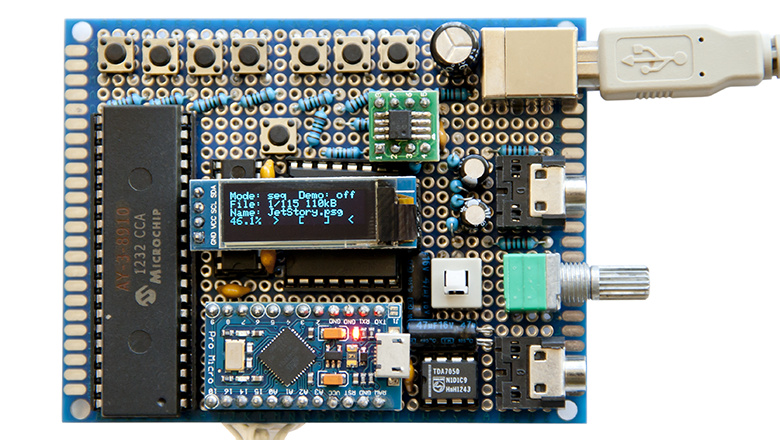

# Arduino-AY-player

Arduino Pro Micro project: chiptune music player on **AY-3-8910** chip with OLED display (SSD1306 128x32) and control buttons for playing PSG files (see below) from SD card.

Based on (and great thanks to the author):
[https://www.youtube.com/watch?v=m23hZ-1JwqI](https://www.youtube.com/watch?v=m23hZ-1JwqI)

**Added**:

- SRAM memory (23LC1024) allowing to read file names from SD card and randomize them without repeats
- 8 buttons: switching between full/demo song playback, random/sequencial playback, previous/next song, +/-5 songs, +/-10 songs
- shift registers: two 74HC595 for controlling AY-3-8910 via 3 pins and 74HC165 for connecting 8 buttons via 3 pins on Arduino
- switch between audio line output and TDA7050 analog amplifier with volume potentiometer for connecting headphones

**Updates**:

- faster refreshing of ABC channel volume indicators (almost no flicker) 
- pressing both buttons 7 and 8 switches between views of volume indicators (> [] < or bars/note freq)
- saving selection of playback modes and volume indicator view type to EEPROM

**Arduino sketch**: AY\_Player\_OLED\_SRAM.ino

**Demo video**:
[https://youtu.be/qcmWFfHZnjQ](https://youtu.be/qcmWFfHZnjQ)

**Video with new modes of indicator**:
[https://youtu.be/EuEVkPjT0Eg](https://youtu.be/EuEVkPjT0Eg)

PSG files can be converted from other chuptune music formats with **AY\_Emul**: [https://bulba.untergrund.net/emulator_e.htm](https://bulba.untergrund.net/emulator_e.htm)

## Needed libraries

**SSD1306Ascii**:
[https://github.com/greiman/SSD1306Ascii](https://github.com/greiman/SSD1306Ascii)

**Frequency generator**:
[https://github.com/Rick-G1/FrequencyGenerator](https://github.com/Rick-G1/FrequencyGenerator)

**SRAM\_23LC**:
[https://github.com/mattairtech/SRAM_23LC](https://github.com/mattairtech/SRAM_23LC)

## Curcuit
See 'Arduino-AY-player-circuit.png' and 'Arduino-AY-player-circuit.pdf'

Update: try to remove 0.1uF capacitor connected to pin 12 of 74HC595 registers if AY-3-8910 doesn't play music.
